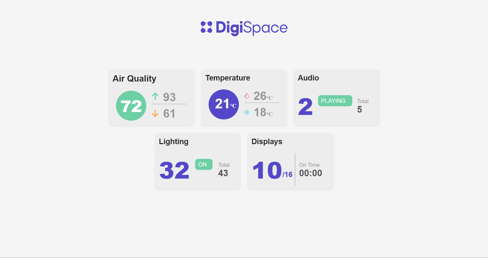
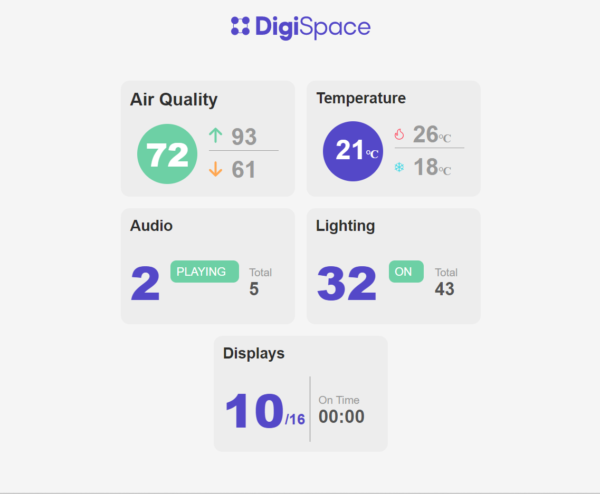
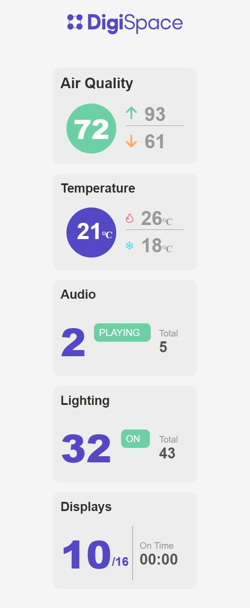
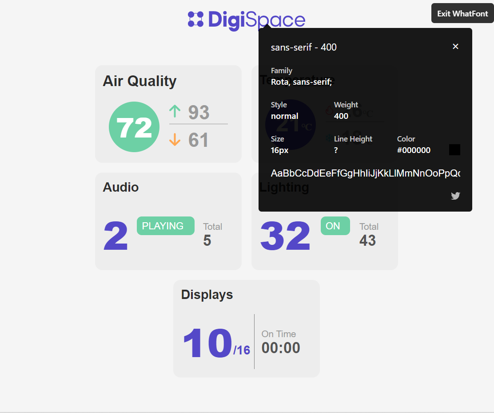
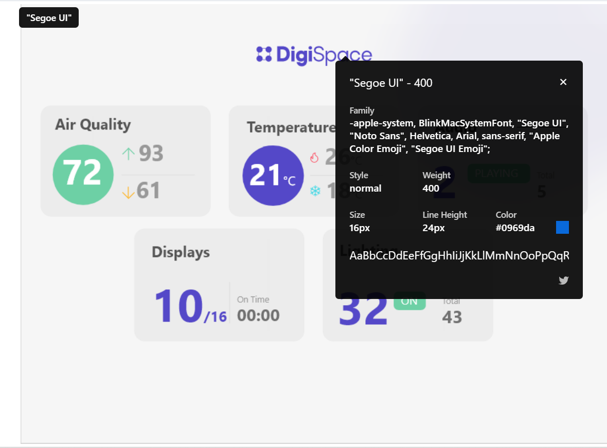

# Weather App
Deployed Link:

Web view:

Screenshot: 
  | Laptop View                            | Tab View                           |  Mobile View                    |
  | :-----------                           | :------------:                     |  ------------:                  |
  |   |  | |
  |                                        |                                    |                                 |

## In order to run this
- clone this repo using: `git clone` https://github.com/SHUBHAMspy/weather-app.git.
- DO `npm install` in root directory of project on terminal to download all packages.
- Then write `npm start` to start the development server.

## Description

- This project was bootstrapped with [Create React App](https://github.com/facebook/create-react-app).
- Weather-widget is an widget web application which displays different utilities in form of widgets.
- **Fonts**: Rota

### Things that was a concern
In order to produce the same width and weight I have to use much larger weight and size
Screenshot: 
  | Font Provided                          | Font in Design                       |  
  | :-----------                           | :------------:                       |  
  |       |   | 
  |                                        |                                      |                                 

# Getting Started with Create React App

This project was bootstrapped with [Create React App](https://github.com/facebook/create-react-app).

## Available Scripts

In the project directory, you can run:

### `npm start`

Runs the app in the development mode.\
Open [http://localhost:3000](http://localhost:3000) to view it in your browser.

The page will reload when you make changes.\
You may also see any lint errors in the console.

### `npm test`

Launches the test runner in the interactive watch mode.\
See the section about [running tests](https://facebook.github.io/create-react-app/docs/running-tests) for more information.

### `npm run build`

Builds the app for production to the `build` folder.\
It correctly bundles React in production mode and optimizes the build for the best performance.

The build is minified and the filenames include the hashes.\
Your app is ready to be deployed!

See the section about [deployment](https://facebook.github.io/create-react-app/docs/deployment) for more information.

